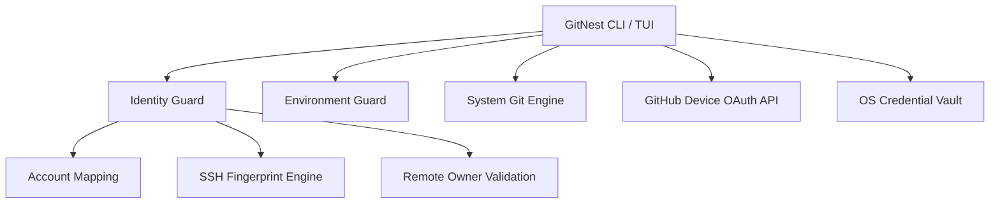

# ◈ GitNest

### One Workspace. Multiple Git Identities.

GitNest is a developer-first Rust CLI/TUI designed for managing multiple GitHub accounts on a single machine safely. It creates explicit identity boundaries around repositories to prevent accidental cross-account Git commits, SSH identity leaks, and remote push collisions.

---

## The Problem

Working with multiple GitHub accounts (such as personal, client, or enterprise identities) on a single workstation often leads to identity leakage:

- **Git Author Collisions**: Committing code with personal `user.email` on a work repository or vice-versa.
- **SSH Key Confusion**: Accidentally authenticating to GitHub as Account A when pushing to Account B's repository.
- **Remote Mismatch**: Pushing changes to a repository owned by another account without security checks.
- **Environment Overrides**: Malicious or accidental `GIT_SSH_COMMAND` environment variables bypassing local SSH configurations.

GitNest solves this by binding repositories directly to specific GitHub identities with **fail-closed** runtime validation.

---

## Why GitNest?

- **✓ Explicit Identity Isolation**: 4-way alignment between Mapped Account, Remote Owner, SSH Key, and Local Git Identity.
- **✓ Dedicated SSH Key Isolation**: Automatically generates and scopes Ed25519 keys with `-o IdentitiesOnly=yes`.
- **✓ Key Tamper Detection**: Cryptographically matches SHA-256 public key fingerprints to block key content swaps.
- **✓ Environment Protection**: Detects and blocks dangerous environment variables (`GIT_SSH_COMMAND`, `GIT_SSH`, `GIT_CONFIG_PARAMETERS`).
- **✓ Vaulted Credential Storage**: Integrates with OS native credential stores (macOS Keychain, Linux Secret Service, Windows Credential Manager).
- **✓ Developer-First TUI**: Built with `ratatui` featuring an interactive dashboard, accounts list, security center, doctor, and command palette (`Ctrl+K`).
- **✓ Atomic Persistence**: Uses `tempfile` with `sync_all()` for corruption-resistant JSON configuration writes.
- **✓ Privacy-Conscious**: Telemetry tracks events using a randomized local UUID `installation_id` with opt-out support.

---

## Visual Architecture



---

## How Identity Isolation Works

```text
Repository Folder
    ↓
Mapped GitHub Account
    ↓
Local Git Identity (user.name / user.email)
    ↓
Dedicated Ed25519 SSH Key
    ↓
SHA-256 Public Key Fingerprint
    ↓
GitHub Remote Owner Verification
```

If any link in this identity chain is broken or mismatched, GitNest fails closed and **BLOCKS** the operation.

### Example Scenario

- **Work Project**: Mapped to `company-account` → Enforces `company@work.com` → Uses `Company_SSH_Key` → Pushes to `github.com/company/repo`.
- **Personal Project**: Mapped to `personal-account` → Enforces `dev@personal.io` → Uses `Personal_SSH_Key` → Pushes to `github.com/personal/repo`.

Attempting to push to `company/repo` while logged in as `personal-account` triggers an immediate **Identity Mismatch BLOCKED** error.

---

## Security Model

### 1. Identity Guard
Validates strict 4-way alignment:
```text
Mapped Account == Remote Owner == Local Git Identity == Verified SSH Fingerprint
```

### 2. SSH Isolation
Every account receives its own isolated Ed25519 SSH key in `~/.gitnest/ssh/`. Invocations pass:
```text
ssh -i "~/.gitnest/ssh/<key_id>" -o IdentitiesOnly=yes -o StrictHostKeyChecking=accept-new
```

### 3. Key Content Swap Protection
GitNest compares public key contents dynamically against a stored SHA-256 fingerprint (`ssh_key_fingerprint`). If key files are maliciously swapped or modified, GitNest blocks execution.

### 4. Environment Protection (`EnvGuard`)
Blocks external environment variable overrides that could alter Git execution, including:
`GIT_SSH_COMMAND`, `GIT_SSH`, `GIT_CONFIG_PARAMETERS`, `GIT_CONFIG_COMMAND`, `GIT_DIR`, and `GIT_WORK_TREE`.

### 5. Secure Credential Vaulting
OAuth access tokens are never saved to disk in plain text. They are stored securely via the OS keyring:
- **macOS**: Apple Keychain Services
- **Linux**: Secret Service API / `libsecret`
- **Windows**: Windows Credential Manager

---

## Installation

### Option 1: Quick Install Script (macOS & Linux)
```bash
curl -fsSL https://raw.githubusercontent.com/siranjeevan/GitNest/main/install.sh | bash
```

### Option 2: Homebrew (macOS & Linux)
```bash
brew install siranjeevan/tap/gitnest
```

### Option 3: Cargo (Rust Developers)
```bash
cargo install gitnest
```

### Option 4: WinGet & Scoop (Windows)
```powershell
# WinGet
winget install siranjeevan.GitNest

# Scoop
scoop bucket add gitnest https://github.com/siranjeevan/GitNest
scoop install gitnest
```

### Option 5: Manual GitHub Releases Download
Download pre-compiled release binaries directly from [GitHub Releases](https://github.com/siranjeevan/GitNest/releases).

#### macOS / Linux
```bash
chmod +x gitnest
mv gitnest /usr/local/bin/
```

#### Windows
Download `gitnest-windows-x86_64.zip`, extract `gitnest.exe`, and add it to your System `PATH`.

---

## Getting Started

Launch the interactive Terminal User Interface (TUI):
```bash
gitnest
```

### TUI Features & Shortcuts

- **Dashboard**: High-level overview of current identity, workspace status, and navigation.
- **Accounts Screen**: View, add, and switch registered GitHub accounts.
- **Identity Security Center**: Realtime security inspection panel.
- **Doctor Screen**: Diagnostic checks for system dependencies and permissions.
- **Command Palette (`Ctrl+K`)**: Rapid search and command execution modal.

```text
Keyboard Controls:
  ↑ / ↓       Navigate options
  Enter       Select item
  Esc         Return to previous screen
  Ctrl+K      Open Command Palette
  q           Quit GitNest
```

---

## Command Reference

GitNest supports both interactive TUI mode and direct non-interactive CLI commands for scripting and CI:

| Command | Action |
|---|---|
| `gitnest` | Launch the interactive TUI Dashboard |
| `gitnest login` | Authenticate a new account via GitHub Device OAuth |
| `gitnest accounts` | List all connected GitHub accounts |
| `gitnest connect` | Map current folder to a registered GitHub account |
| `gitnest create <name>` | Create a GitHub repository and initialize local folder |
| `gitnest clone <url>` | Clone a repository with automatic account mapping |
| `gitnest push` | Perform identity-validated Git push |
| `gitnest identity` | Display identity and security details for current workspace |
| `gitnest doctor` | Run full system health and security diagnostics |

---

## Common Workflows

### 1. Connecting a Local Directory
```bash
cd ~/my-cool-project
gitnest connect
```

### 2. Creating a New Repository
```bash
gitnest create my-awesome-app
```

### 3. Cloning a Repository
```bash
gitnest clone git@github.com:siranjeevan/GitNest.git
```

### 4. Safe Pushing
```bash
gitnest push
```

---

## Security Failure Example

If an identity mismatch is detected, GitNest displays a clear warning and halts execution:

```text
⚠ IDENTITY MISMATCH DETECTED

Repository Owner : company-org
Selected Account : personal-user

GitNest blocked this operation to prevent accidental cross-account pushes.

Action Required:
  → Switch to the mapped company account: `gitnest accounts`
  → Or update repository remote URL.
```

---

## Supported Platforms

| Platform | Architecture | Status |
|---|---|---|
| **macOS** | ARM64 (Apple Silicon) | Verified |
| **macOS** | x86_64 (Intel) | Verified |
| **Linux** | x86_64 | Verified |
| **Linux** | ARM64 | Verified |
| **Windows** | x86_64 | Verified |

---

## Privacy & Telemetry

GitNest collects minimal telemetry to understand feature usage:
- Telemetry events include: `event_type`, `os`, `arch`, `version`, `timestamp`, and a **randomly generated local UUID** (`installation_id`).
- GitNest **never** collects or transmits usernames, repository names, OAuth tokens, SSH keys, or personal emails.
- Telemetry can be disabled by setting `telemetry_enabled = false` in `~/.gitnest/config.toml`.

---

## Project Structure

```text
src/
├── auth/         # GitHub Device OAuth authentication flow
├── cli/          # Command-line handlers and argument parsing
├── config/       # Configuration manager & model
├── domain/       # Account, project, and error models
├── git/          # Git executor and subprocess wrappers
├── providers/    # GitHub API client integration
├── security/     # IdentityGuard and EnvGuard enforcement
├── services/     # Account, Project, Telemetry, and Backup services
├── ssh/          # Ed25519 SSH key generation and management
├── storage/      # Atomic JSON storage & OS keyring secure store
└── ui/           # Ratatui TUI layouts, theme system, and state engine
```

---

## Development & Building

Building GitNest locally requires Rust 1.75+:

```bash
# Clone repository
git clone git@github.com:siranjeevan/GitNest.git
cd GitNest

# Check formatting & linting
cargo fmt --check
cargo clippy -- -D warnings

# Run test suite
cargo test

# Build debug binary
cargo build

# Build & install release binary
cargo install --path .
```

---

## Test Verification

The GitNest test suite covers unit, integration, and adversarial security scenarios:

```text
cargo fmt --check      ✓ PASS
cargo check            ✓ PASS
cargo clippy           ✓ PASS (0 warnings)
cargo test             ✓ PASS (13 tests passing)
Security Matrix        ✓ PASS (IdentityGuard & EnvGuard verified)
```

---

## Releases

Official binaries and checksums are available on [GitHub Releases](https://github.com/siranjeevan/GitNest/releases).

---

## Known Limitations

- **Multi-Step Operation Recovery**: Sagas/journals for multi-step network interruptions are deferred to v1.1.
- **GitHub API Key Ownership Revalidation**: SSH key ownership relies on local cryptographic SHA-256 fingerprint verification in v1.0.

---

## Roadmap

### v1.1
- Multi-step transactional operation recovery
- GitHub API SSH key ownership revalidation
- Reproducible build verification

---

## Contributing

Contributions are welcome! Please follow these steps:

1. Fork the repository and create a feature branch.
2. Implement your changes following established Rust and security patterns.
3. Ensure `cargo fmt`, `cargo clippy -- -D warnings`, and `cargo test` pass cleanly.
4. Submit a Pull Request.

---

## Security Reporting

If you discover a security vulnerability, please report it privately through GitHub Security Advisories on the repository's Security tab instead of opening a public issue.

---

## License

This project is licensed under the MIT License.
